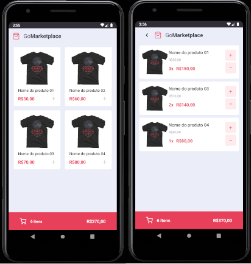

# Desafio 08: Fundamentos do React Native

Este é um desafio do GoStack Bootcamp da RocketSeat. [Link para o desafio](https://github.com/Rocketseat/bootcamp-gostack-desafios/tree/master/desafio-fundamentos-react-native)

Nesse desafio, foi desenvolvido uma aplicação mobile, a GoMarketplace, com o objetivo de praticar o que foi aprendido até agora no React Native, junto com TypeScript, utilizando rotas, Async Storage e a Context API.



# Requisitos

* NodeJs - (desenvolvido utilizando a versão v12.16.2)
* Yarn - (opcional - versão 1.22.4)

# Tecnologias utilizadas

* React Native
* Typescript
* Styled Components
* Async Storage
* Context API

# Instalação

1 - Fazer o gitclone:

```
git clone https://github.com/frfontoura/gostack-gomarketplace
```

2 - Instalar as dependências:
```
yarn
```

3 - Para utilizar a Fake API, executar o servidor:
```
yarn json-server server.json -p 3333
```

4 - Abrir o emulador(testado no Android Pie), e executar o comando:
```
abd reverse tcp:3333 tcp:3333
```

5 - Executar o comando:
```
yarn start
```

6 - Executar o comando:
```
yarn android
```

# Executando os testes

Para executar os testes, utilizar o comando:
```
yarn test
```
